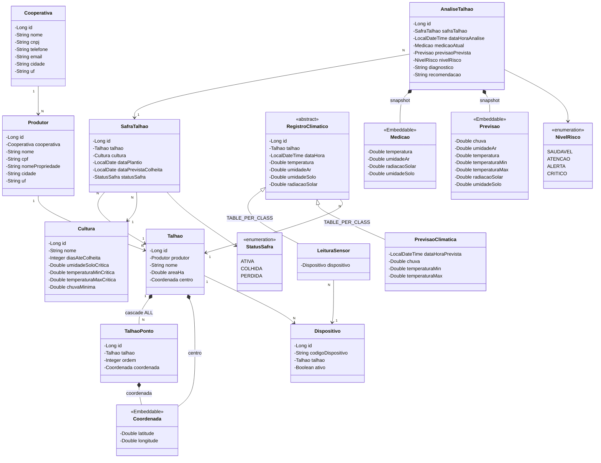

# safracerta-api — Global Solution 2026/1 | Java Advanced

API REST de monitoramento inteligente de talhões agrícolas, desenvolvida com Spring Boot + Spring AI — Global Solution de **Java Advanced (2TDS)**, FIAP 2026/1.

O serviço recebe leituras de sensores ESP32 e previsões do Open-Meteo, executa um **motor de risco determinístico** a cada nova leitura e aciona o **Gemini** para gerar diagnóstico e recomendação em linguagem natural. O nível de risco fica registrado em cada análise do talhão e é consumido pelo app do produtor e pelo dashboard da cooperativa.

---

## Integrantes do Grupo

| Nome | RM |
|------|----|
| Felipe Yuiti Ishii | 565339 |
| Gabriel Nogueira Peixoto | 563925 |
| Giovanna Neri dos Santos | 566154 |
| Mariana Inoue | 565834 |

> Representante (RM no nome dos containers DevOps): **565339**.

---

## Stack

- **Java 21** · **Spring Boot 3.4.5**
- **Spring AI 1.1.6** — Gemini 2.5 Flash via starter `spring-ai-starter-model-openai` (endpoint OpenAI-compatible)
- **Spring Data JPA + Hibernate** — 10 tabelas + superclasse abstrata (herança `TABLE_PER_CLASS`)
- **Spring HATEOAS** — hypermedia nos responses
- **Oracle** (JDBC `ojdbc11`) · **Bean Validation** · **Lombok** · **DevTools**
- **Springdoc OpenAPI 2.8.8** — Swagger UI

> Variáveis de ambiente: `ORACLE_URL`, `ORACLE_USER`, `ORACLE_PASSWORD`, `GEMINI_API_KEY`. `ddl-auto: update` em dev. Sem autenticação nesta rodada.

---

## Estrutura do Projeto

```
com/safracerta/api/
├── entity/              # Entidades JPA (10 tabelas + RegistroClimatico abstrata)
│   ├── embeddable/      # @Embeddable: Coordenada, Medicao, Previsao
│   └── enums/           # NivelRisco, StatusSafra
├── repository/          # Spring Data JPA — um JpaRepository por agregado
├── service/             # Regras de negócio: CRUD + MotorDeRiscoService + DiagnosticoService
├── controller/          # REST controllers com HATEOAS e @Operation Swagger
├── assembler/           # RepresentationModelAssembler (HATEOAS) — um por recurso
├── dto/                 # Records por domínio (flat, sem subpastas request/response)
│   ├── cooperativa/     # CooperativaRequest, CooperativaResponse, PainelCooperativaResponse
│   ├── produtor/        # ProdutorRequest, ProdutorResponse, ProdutorCardResponse
│   ├── talhao/          # TalhaoRequest, TalhaoResponse, CoordenadaDto, TalhaoPontoDto, TalhaoSituacaoResponse
│   ├── cultura/         # CulturaRequest, CulturaResponse
│   ├── safra/           # SafraTalhaoRequest, SafraTalhaoResponse
│   ├── dispositivo/     # DispositivoRequest, DispositivoResponse
│   ├── leitura/         # LeituraRequest, LeituraResponse
│   ├── previsao/        # PrevisaoResponse, PrevisaoDto
│   └── analise/         # AnaliseResponse, MedicaoDto, ContextoAnalise, DiagnosticoIa
├── validation/          # @OrdensDistintas + OrdensDistintasValidator (Bean Validation custom)
├── client/              # Integrações HTTP externas
│   └── openmeteo/       # OpenMeteoClient (RestClient), OpenMeteoResponse, OpenMeteoMapper
├── exception/           # NotFoundException, ConflictException
├── handler/             # GlobalExceptionHandler (@RestControllerAdvice), ErrorResponse
└── config/              # ChatClientConfig (Spring AI), CorsConfig, OpenApiConfig, CulturaSeeder
```

---

## Como Executar

### Pré-requisitos
- Docker + Docker Compose
- Chave Gemini — [Google AI Studio](https://aistudio.google.com) (opcional: sem ela a IA degrada para `null` e o motor segue)

### Configuração
```bash
cp .env.example .env
```
```env
ORACLE_URL=jdbc:oracle:thin:@oracle-xe:1521/XEPDB1
ORACLE_USER=rm565339
ORACLE_PASSWORD=sua_senha
ORACLE_ROOT_PASSWORD=senha_root
ORACLE_APP_USER=rm565339
ORACLE_APP_PASSWORD=sua_senha
GEMINI_API_KEY=sua_chave_aqui
```

### Docker (recomendado)
```bash
docker compose up -d
docker compose logs -f        # aguardar Oracle + API subirem (~3-5 min)
```

### Local (requer Oracle de pé)
```bash
mvn spring-boot:run
```

A aplicação sobe em `http://localhost:8080`.

---

## Modelo de Dados

### Entidades — 10 tabelas + 1 superclasse abstrata

| Entidade | Tabela | Relacionamentos |
|---|---|---|
| `Cooperativa` | `T_SC_COOPERATIVA` | 1:N → Produtor |
| `Produtor` | `T_SC_PRODUTOR` | N:1 → Cooperativa; 1:N → Talhao |
| `Cultura` | `T_SC_CULTURA` | catálogo; limiares de risco |
| `Dispositivo` | `T_SC_DISPOSITIVO` | N:1 → Talhao; `codigoDispositivo` único |
| `Talhao` | `T_SC_TALHAO` | N:1 → Produtor; `[Coordenada centro]`; 1:N TalhaoPonto |
| `TalhaoPonto` | `T_SC_TALHAO_PONTO` | N:1 → Talhao; `ordem`; unique `(talhao_id, ordem)` |
| `SafraTalhao` | `T_SC_SAFRA_TALHAO` | N:1 → Talhao/Cultura; 1:N → AnaliseTalhao |
| `RegistroClimatico` | — (abstrata) | base `TABLE_PER_CLASS`; N:1 → Talhao |
| `LeituraSensor` | `T_SC_LEITURA_SENSOR` | herda `RegistroClimatico`; N:1 → Dispositivo |
| `PrevisaoClimatica` | `T_SC_PREVISAO_CLIMATICA` | herda `RegistroClimatico`; + `chuva`, `temperaturaMin/Max` |
| `AnaliseTalhao` | `T_SC_ANALISE_TALHAO` | N:1 → SafraTalhao; snapshot `[Medicao]` + `[Previsao]` |

> **Sem entidade `Alerta`** — o nível de risco vive em `AnaliseTalhao`; "alerta/crítico" é rótulo de UI derivado do enum.

### Embeddables — 3 `@Embeddable`

| Embeddable | Campos | Usado em |
|---|---|---|
| `Coordenada` | `latitude`, `longitude` | `Talhao`, `TalhaoPonto` |
| `Medicao` | `temperatura`, `umidadeAr`, `radiacaoSolar`, `umidadeSolo` | `AnaliseTalhao` (snapshot) |
| `Previsao` | `chuva`, `umidadeAr`, `temperatura`, `temperaturaMin/Max`, `radiacaoSolar`, `umidadeSolo` | `AnaliseTalhao` (snapshot) |

> Herança `RegistroClimatico` → `LeituraSensor`/`PrevisaoClimatica` em `TABLE_PER_CLASS`: cada subclasse tem tabela completa, sem tabela base no banco.

### Enums

| Enum | Valores |
|---|---|
| `NivelRisco` | `SAUDAVEL` · `ATENCAO` · `ALERTA` · `CRITICO` |
| `StatusSafra` | `ATIVA` · `COLHIDA` · `PERDIDA` |

> A API devolve `nivelRisco` **cru**; o front renderiza rótulo/cor. "Em risco" = nível ∈ {ALERTA, CRITICO}.

### Diagrama de Classes — Entidades



---

## Como Testar

### Via Swagger UI

Acesse `http://localhost:8080/swagger-ui.html` (ou a URL do deploy em produção).

A UI exibe todos os recursos organizados por tag. Para executar um endpoint:

1. Clique na tag desejada (ex: **Culturas**) para expandir os endpoints do recurso.
2. Clique no endpoint que deseja testar (ex: `GET /cultura`).
3. Clique em **Try it out**.
4. Preencha os parâmetros (se houver) e clique em **Execute**.
5. A resposta aparece logo abaixo com status HTTP, headers e body.

> **Dica:** o `GET /cultura` não precisa de parâmetros e lista as 14 culturas carregadas no boot — bom ponto de partida para confirmar que a API está no ar.

<!-- PRINT: captura do Swagger UI com as tags expandidas (Cooperativas, Produtores, Culturas…) -->
<!-- Sugestão de nome: assets/swagger-ui-tags.png -->

---

### Via Postman

**Importar a collection:**
1. Abra o Postman e clique em **Import**.
2. Selecione o arquivo `docs/postman/SafraCerta.postman_collection.json`.
3. A collection **SafraCerta API** aparece na barra lateral com 9 pastas (uma por recurso).

<!-- PRINT: captura da collection importada no Postman, mostrando as 9 pastas na sidebar -->
<!-- Sugestão de nome: assets/postman-collection-importada.png -->

**Configurar as variáveis:**
A collection usa variáveis para os IDs (evita editar cada URL manualmente). Depois de criar os primeiros registros, atualize a aba **Variables** da collection:

| Variável | Valor inicial | Atualizar para |
|---|---|---|
| `baseUrl` | `http://localhost:8080` | URL do deploy em produção (se aplicável) |
| `cooperativaId` | `1` | id retornado no `POST /cooperativa` |
| `produtorId` | `1` | id retornado no `POST /produtor` |
| `culturaId` | `1` | id de uma cultura do seed (ver `GET /cultura`) |
| `talhaoId` | `1` | id retornado no `POST /talhao` |
| `safraId` | `1` | id retornado no `POST /safra` |
| `dispositivoId` | `1` | id retornado no `POST /dispositivo` |
| `analiseId` | `1` | id retornado em `GET /analise` |

<!-- PRINT: captura da aba Variables da collection no Postman -->
<!-- Sugestão de nome: assets/postman-variaveis.png -->

---

### Roteiro de teste — Fluxo Principal (Motor de Risco)

Execute na ordem abaixo para acionar o fluxo completo: ingestão de leitura → previsão → motor de risco → análise + IA.

| Passo | Recurso | Método | Rota | O que observar |
|---|---|---|---|---|
| 1 | Cooperativas | `POST` | `/cooperativa` | `201` + id retornado |
| 2 | Produtores | `POST` | `/produtor` | `201` + id retornado |
| 3 | Talhões | `POST` | `/talhao` | `201` + `centro` preenchido (necessário para previsão) |
| 4 | Culturas | `GET` | `/cultura` | listar as 14 do seed; anotar o id de `Soja` (culturaId `1`) |
| 5 | Safras | `POST` | `/safra` | `201` com `statusSafra: ATIVA` — sem safra ativa o motor não roda |
| 6 | Dispositivos | `POST` | `/dispositivo` | `201`; campo `codigoDispositivo` será usado no POST de leitura |
| 7 | Leituras | `POST` | `/leitura` | `201` — **este POST dispara o motor**: coleta previsão + calcula risco + chama Gemini |
| 8 | Análises | `GET` | `/analise/ultima?talhaoId={{talhaoId}}` | deve retornar `nivelRisco`, `diagnostico` e `recomendacao` |

> **O que o Passo 7 faz por baixo dos panos:**
> 1. Se o dispositivo estava inativo (`ativo: false`), **ativa-o automaticamente** antes de prosseguir
> 2. Salva a `LeituraSensor` (ESP32)
> 3. Chama Open-Meteo e salva `PrevisaoClimatica` (throttle: só faz nova chamada se a última tiver > 24h)
> 4. Verifica se o talhão tem safra **ATIVA** — se não tiver, para aqui
> 5. Conta os fatores de risco disparados (solo seco / geada / calor / déficit hídrico) contra os limiares da cultura
> 6. Classifica: `0 fatores=SAUDAVEL`, `1=ATENCAO`, `2=ALERTA`, `3+=CRITICO`
> 7. Chama o Gemini para gerar `diagnostico` e `recomendacao` em texto (com fallback se a chave faltar)
> 8. Persiste `AnaliseTalhao` com o snapshot completo

<!-- PRINT: captura do response do POST /leitura mostrando status 201 -->
<!-- PRINT: captura do GET /analise/ultima mostrando nivelRisco + diagnostico + recomendacao -->
<!-- Sugestão de nomes: assets/postman-leitura-201.png · assets/postman-analise-resultado.png -->

---

### Validações — respostas de erro

| Situação | Exemplo | Status |
|---|---|---|
| Campo obrigatório ausente / fora de faixa | `POST /leitura` com `temperatura: 999` | `400` com `fieldErrors` |
| Parâmetro de query obrigatório ausente | `GET /analise` sem `talhaoId` | `400` com `fieldErrors` |
| JSON malformado ou enum inválido | `POST /safra` com `"statusSafra": "INVALIDO"` | `400` |
| Recurso inexistente | `GET /produtor/999999` | `404` |
| `cnpj` / `cpf` / código duplicado | `POST /cooperativa` com CNPJ repetido | `409` |
| Dispositivo inativo na leitura | `POST /leitura` de dispositivo `ativo: false` | `409` |

---

## Recursos e Rotas

> Rotas no singular. Base local: `http://localhost:8080`.

| Recurso | Métodos | Rotas | Observações |
|---|---|---|---|
| Cooperativa | `GET POST PUT DELETE` | `/cooperativa` · `/cooperativa/{id}` | `cnpj` único; delete em cascata |
| → Painel | `GET` | `/cooperativa/{id}/painel` | contadores + distribuição por nível |
| → Produtores (cards) | `GET` | `/cooperativa/{id}/produtores` | área total, nº talhões, nº em risco |
| Produtor | `GET POST PUT DELETE` | `/produtor` · `/produtor/{id}` | filtro `?cooperativaId=`; `cpf` único |
| → Talhões (situação) | `GET` | `/produtor/{id}/talhoes` | cultura, medição, nível, polígono |
| Cultura | `GET POST PUT DELETE` | `/cultura` · `/cultura/{id}` | catálogo + limiares; `nome` único |
| Talhão | `GET POST PUT DELETE` | `/talhao` · `/talhao/{id}` | filtro `?produtorId=`; `centro` + `pontos` |
| → Situação | `GET` | `/talhao/{id}/situacao` | situação atual do talhão |
| Safra | `GET POST PUT DELETE` | `/safra` · `/safra/{id}` | filtro `?talhaoId=`; `statusSafra` |
| Dispositivo | `GET POST PUT DELETE` | `/dispositivo` · `/dispositivo/{id}` | 1 por talhão; delete em cascata das leituras |
| Leitura | `GET POST` | `/leitura?talhaoId={id}` · `/leitura` | ingestão ESP32 — dispara motor + IA |
| Previsão | `GET` | `/previsao?talhaoId={id}` | histórico Open-Meteo |
| Análise | `GET` | `/analise?talhaoId={id}` · `/analise/ultima?talhaoId={id}` · `/analise/{id}` | histórico, última, detalhe |

---

## Exemplos de Payload (POST)

**`POST /cooperativa`**
```json
{ "nome": "Cooperativa Boa Esperança", "cnpj": "12345678000190", "telefone": "3433334444",
  "email": "contato@coop.com.br", "logradouro": "Rod. BR-050", "numero": "km 12",
  "bairro": "Zona Rural", "cidade": "Uberaba", "cep": "38000000", "uf": "MG" }
```

**`POST /produtor`** (`cooperativaId` obrigatório; `numero` é String — aceita `"S/N"`)
```json
{ "cooperativaId": 1, "nome": "João Silva", "telefone": "34999991111", "cpf": "12345678900",
  "dataNascimento": "1980-05-12", "nomePropriedade": "Fazenda Boa Esperança", "caf": "CAF-001",
  "logradouro": "Rod. BR-050", "numero": "km 12", "bairro": "Zona Rural", "cidade": "Uberaba",
  "cep": "38000000", "uf": "MG" }
```

**`POST /talhao`** (`centro` alimenta a previsão; `pontos` = polígono, `ordem` única por talhão)
```json
{ "produtorId": 1, "nome": "Talhão Norte", "areaHa": 45.0,
  "centro": { "latitude": -19.75, "longitude": -47.93 },
  "pontos": [ { "ordem": 0, "latitude": -19.749, "longitude": -47.931 },
              { "ordem": 1, "latitude": -19.751, "longitude": -47.929 } ] }
```

**`POST /safra`**
```json
{ "talhaoId": 1, "culturaId": 1, "dataPlantio": "2026-01-15",
  "dataPrevistaColheita": "2026-06-24", "statusSafra": "ATIVA" }
```

**`POST /dispositivo`**
```json
{ "codigoDispositivo": "ESP32-001", "talhaoId": 1, "ativo": true }
```

**`POST /leitura`** (ESP32 — faixas: temp −50..60 °C, umidades 0..100 %, radiação 0..1500 W/m²)
```json
{ "codigoDispositivo": "ESP32-001", "dataHora": "2026-06-09T09:41:00",
  "temperatura": 26.0, "umidadeAr": 72.0, "umidadeSolo": 18.0, "radiacaoSolar": 456.0 }
```

> `umidadeSolo: 18.0` com cultura Soja (`umidadeSoloCritica: 30.0`) dispara 1 fator → `NivelRisco: ATENCAO`.

---


---

## Motor de Risco + IA

```
POST /leitura  (ESP32)
      │
      ▼
LeituraSensorService ── salva LeituraSensor + coleta Previsão Open-Meteo (throttle 24h)
      │
      ▼
MotorDeRiscoService  (só age se o talhão tem safra ATIVA)
      ├── avalia 4 fatores contra os limiares da Cultura:
      │     solo seco · geada (tempMin D+1) · calor (tempMax D+1) · déficit hídrico (chuva D+1)
      ▼
NivelRisco  ←  0 fatores=SAUDAVEL · 1=ATENCAO · 2=ALERTA · 3+=CRITICO
      │
      ▼
DiagnosticoService ── Gemini 2.5 Flash   (opcional, com fallback null se sem chave)
      │
      ▼
AnaliseTalhao  (snapshot: Medicao + Previsao + nivelRisco + diagnostico + recomendacao)
```

**Separação de responsabilidades:** o motor determinístico decide o nível (auditável). O Gemini **só descreve** — não inventa números, não altera o nível. Se a IA falhar, a análise é salva sem texto.

**`AnaliseTalhao` é snapshot:** copia os valores no momento da análise; o histórico é autossuficiente e independe de leituras antigas continuarem existindo.

---

## Links

| | |
|---|---|
| Deploy (nuvem) | *(atualizar após o deploy)* |
| Swagger UI (produção) | *(atualizar após o deploy)* |
| Postman collection | [`docs/postman/SafraCerta.postman_collection.json`](docs/postman/SafraCerta.postman_collection.json) |
| Vídeo de apresentação | *(atualizar após a gravação)* |
